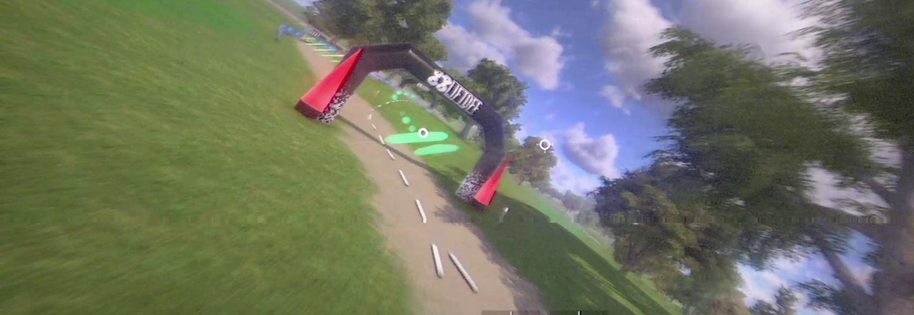

# liftoff-flight-analyzer

## Purpose

Flying a lap and knowing *why* it was slow are two different things. You can feel
that a corner went wrong, but not whether you lost the time by turning too late,
by sailing past the gate and doubling back, or by stopping to rotate the quad
because the turn never bent the path in the first place. Watching the replay back
rarely settles it — the tell is in the stick inputs, and those are invisible.

This is a coach for [Liftoff: FPV Drone Racing](https://www.lugus-studios.be/liftoff)
that reads your saved in-game replays and answers that question with numbers
instead of impressions. It reconstructs what the quad and your hands were
actually doing through every corner of every lap, finds each place you lost time,
and — this is the part that matters — tells you the cause of each one, separating
the mistakes that are yours from the ones the track asked for.

The goal is one clear fix per session. Not a wall of telemetry, and not three
things to work on at once.

## How to use it

Install it as a [Claude Code](https://claude.com/claude-code) skill:

```bash
git clone https://github.com/HaroldHormaechea/liftoff-flight-analyzer \
  ~/.claude/skills/liftoff-flight-analyzer
```

**Save a replay in Liftoff** from the finish screen or the pause menu — that is
the only thing you have to remember to do. Nothing needs to be running while you
fly. Save your good runs as well as your bad ones; a fast lap is worth more to
analyse than a scrappy one.

Then just ask, in your own words:

> Review my last Liftoff flight

> How did that race go?

> Debrief my last lap — why was it so much slower than my best?

> Did I actually fix the thing you told me about last time?

**What you get back:** a short debrief. Your pace and how coordinated your flying
was, lap by lap. Every place the quad slowed down or stopped, each labelled with
why it happened. What you did *well*, called out by name — a corner flown right
looks just as distinct in the data as one flown wrong. Then one thing to fix and
one drill to fix it with.

It also tracks your personal bests between sessions, so it will notice when you
beat a time — including on flights you never saved a replay for.

**Over time it gets more useful.** Ask it to keep notes on you, and each debrief
is written against what you were working on last time. Instead of the same advice
every session, you get whether the last fix actually landed, measured rather than
guessed.

**Two caveats.** A flight with no saved replay can't be analysed — there is no
video or screen-recording fallback, by design. And this reads Liftoff only; other
sims don't expose the same data.
