Race: <b>03 - Stuff That Works</b> &nbsp;·&nbsp; Race, 3 laps 
Drone: <b>Borrum 180 X (Tutorial)</b>

2026-08-28 14:07 <b>1:20.953</b>

## Debrief

Three timed laps on Stuff That Works: 26.18 / 26.83 / 27.93, spread 1.75 s. Zero stalls, zero seconds under 10 km/h, and **no 0-20 km/h band in any of the three laps**. Three skidded corners of 33, against 18 of 41 in the 13:25 attempt on the same track.

The standing drill - never below 20 km/h - was held for a full race unprompted. The rest of the day is the control group for it: across the twelve Bardwells Yard laps flown today, the four laps with zero time under 20 km/h are the four fastest. Every lap that dipped below 20 degraded in the same order - speed falls, yaw-only share climbs to 30-32%, stalls appear, lap time follows.

That closes lap-to-lap decay as a separate fault. It is not stamina; three laps within 1.75 s of each other rule that out. It is one dip under 20 km/h and the lap unravelling from there.

Throttle discipline through corners is established and needs no further attention: 23 of 33 corners gained throttle, 18 of 33 exited faster than they entered.

The limitation this run exposes is transfer. The floor holds on a known track and is dropped on an unknown one - the 15:03 Nineteenth Hole run contains 42.5 s under 20 km/h in a single lap, flown as a race on a circuit seen for the first time.

### Recommendations

1. **On any new track, fly three laps with the clock ignored** and one rule: never below 20 km/h. Wide exits are free. Only then save a race.
2. **Keep the 20 km/h floor as the scored metric**, not lap time. It is the variable that moves the lap time.
3. **Save the fast runs.** Liftoff holds a 0:22.350 lap here with no replay for it; the reviewed recordings are the slower attempts.

## Data analysis

- **0.0 s below 10 km/h** across 80.9 s of flying, 0% of the run.
- **Throttle was added in 23 of 33 corners**, and **18 of 33 exited faster than they entered**.
- **3 corners skidded** (over 30 deg of sideslip).
- **Best lap here was 0:26.184, against a personal best of 0:22.350** on the same geometry (+3.8 s).

## Lap times

## Flight playback

The dashed ray is where the quad is *going*. The arrow is where it is *pointing*. When they separate, that gap is sideslip: the quad is travelling sideways and the camera is not saying so. The follow cam is the same flight magnified, because at whole-lap scale the gap is a few pixels wide.

Lap 1

Lap 2

Lap 3

Laps overlaid

Every lap on one map, each a different colour. Where the laps separate is a LINE difference. No change of stick technique moves a line - only knowing the track does.

## Highlights and recordings

| Segment | s | spd med | spd p90 | spd max | tilt med | slip med | slip p90 | thr med | under 10 km/h |
|---|---|---|---|---|---|---|---|---|---|
| lap 1 | 26.2 | 52 | 68 | 82 | 40 | 15.4 | 32.8 | 0.67 | 0.0 |
| lap 2 | 26.8 | 52 | 72 | 87 | 47 | 18.0 | 47.6 | 0.68 | 0.0 |
| lap 3 | 27.9 | 48 | 64 | 75 | 38 | 12.0 | 23.4 | 0.67 | 0.0 |

**Yaw without roll.** A turn flown on yaw alone is a pirouette: the airframe rotates, the path does not bend.

| Segment | yaw held (s) | roll at zero (s) | share | mean km/h | p90 by speed band |
|---|---|---|---|---|---|
| lap 1 | 7.6 | 0.9 | 12% | 63.5 | 20-35: roll 0.66, yaw 0.31 / 35-max: roll 0.62, yaw 0.43 |
| lap 2 | 8.4 | 0.8 | 10% | 50.2 | 20-35: roll 0.33, yaw 0.70 / 35-max: roll 0.61, yaw 0.43 |
| lap 3 | 9.2 | 0.8 | 9% | 52.1 | 20-35: roll 0.53, yaw 0.28 / 35-max: roll 0.49, yaw 0.33 |

Tilt and stick traces

Corners (33)

| Segment | # | t | entry | min | exit | tilt | slip | radius m | thr in | d thr |
|---|---|---|---|---|---|---|---|---|---|---|
| lap 1 | 1 | 2.5 | 62 | 57 | 57 | 48 | 6.2 | 21.1 | 0.66 | +0.06 |
| lap 1 | 2 | 3.4 | 50 | 49 | 73 | 82 | 23.4 | 12.0 | 0.60 | +0.29 |
| lap 1 | 3 | 4.3 | 79 | 46 | 46 | 57 | 21.3 | 16.1 | 0.96 | -0.11 |
| lap 1 | 4 | 9.0 | 49 | 35 | 35 | 35 | 40.5 | 18.0 | 0.59 | -0.02 |
| lap 1 | 5 | 10.4 | 31 | 25 | 33 | 55 | 26.5 | 5.5 | 0.50 | +0.14 |
| lap 1 | 6 | 11.5 | 43 | 43 | 53 | 47 | 7.8 | 17.4 | 0.82 | -0.08 |
| lap 1 | 7 | 14.6 | 42 | 33 | 35 | 48 | 16.2 | 12.8 | 0.58 | +0.01 |
| lap 1 | 8 | 17.5 | 45 | 45 | 52 | 48 | 8.7 | 20.4 | 0.90 | -0.14 |
| lap 1 | 9 | 20.2 | 71 | 50 | 50 | 45 | 16.2 | 27.9 | 1.00 | -0.27 |
| lap 1 | 10 | 24.6 | 59 | 59 | 82 | 65 | 26.4 | 22.6 | 0.69 | +0.11 |
| lap 2 | 1 | 1.7 | 60 | 48 | 48 | 30 | 16.4 | 22.5 | 0.70 | -0.00 |
| lap 2 | 2 | 2.6 | 44 | 43 | 53 | 47 | 9.8 | 15.2 | 0.53 | +0.17 |
| lap 2 | 3 | 5.7 | 44 | 44 | 47 | 53 | 15.2 | 15.3 | 0.44 | +0.18 |
| lap 2 | 4 | 7.6 | 75 | 75 | 78 | 52 | 6.9 | 37.1 | 0.92 | -0.03 |
| lap 2 | 5 | 8.8 | 64 | 34 | 37 | 62 | 31.1 | 11.5 | 0.60 | +0.14 |
| lap 2 | 6 | 10.6 | 51 | 51 | 55 | 44 | 14.2 | 17.1 | 0.90 | -0.09 |
| lap 2 | 7 | 11.5 | 45 | 45 | 50 | 57 | 9.4 | 21.1 | 0.47 | +0.16 |
| lap 2 | 8 | 13.0 | 49 | 33 | 49 | 49 | 28.1 | 12.9 | 0.57 | +0.10 |
| lap 2 | 9 | 16.1 | 60 | 55 | 60 | 36 | 7.7 | 20.2 | 0.85 | +0.03 |
| lap 2 | 10 | 17.3 | 47 | 45 | 56 | 76 | 12.6 | 12.7 | 0.36 | +0.39 |
| lap 2 | 11 | 19.8 | 57 | 48 | 49 | 49 | 16.6 | 15.2 | 0.70 | +0.03 |
| lap 2 | 12 | 21.7 | 47 | 47 | 56 | 53 | 12.5 | 12.8 | 0.52 | +0.28 |
| lap 2 | 13 | 24.2 | 38 | 28 | 50 | 48 | 32.1 | 7.4 | 0.55 | +0.24 |
| lap 3 | 1 | 2.4 | 62 | 43 | 43 | 52 | 12.5 | 15.9 | 0.71 | -0.01 |
| lap 3 | 2 | 6.3 | 45 | 45 | 50 | 34 | 3.8 | 17.8 | 0.57 | +0.19 |
| lap 3 | 3 | 8.8 | 45 | 20 | 21 | 42 | 19.5 | 14.9 | 0.62 | +0.05 |
| lap 3 | 4 | 13.1 | 25 | 23 | 24 | 31 | 13.3 | 6.5 | 0.37 | +0.22 |
| lap 3 | 5 | 17.1 | 38 | 38 | 43 | 40 | 20.3 | 12.4 | 0.58 | +0.14 |
| lap 3 | 6 | 19.9 | 48 | 48 | 54 | 45 | 17.1 | 16.5 | 0.79 | -0.00 |
| lap 3 | 7 | 21.5 | 47 | 47 | 60 | 66 | 4.4 | 17.5 | 0.41 | +0.31 |
| lap 3 | 8 | 23.5 | 64 | 60 | 60 | 38 | 20.1 | 25.9 | 0.72 | +0.07 |
| lap 3 | 9 | 24.3 | 58 | 57 | 57 | 48 | 6.6 | 28.1 | 0.58 | +0.10 |
| lap 3 | 10 | 26.5 | 62 | 62 | 75 | 56 | 8.6 | 25.4 | 0.76 | +0.12 |

---

Replay `20260828-140705_BardwellsYard_Race_3lap.xml` · samples in `flight.csv` · **full analysis, including everything not drawn above, in `analysis.json`** · generated 2026-08-30 11:19 by `fpv_report.py`
